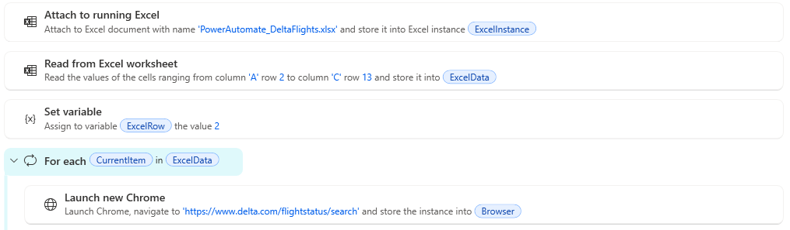
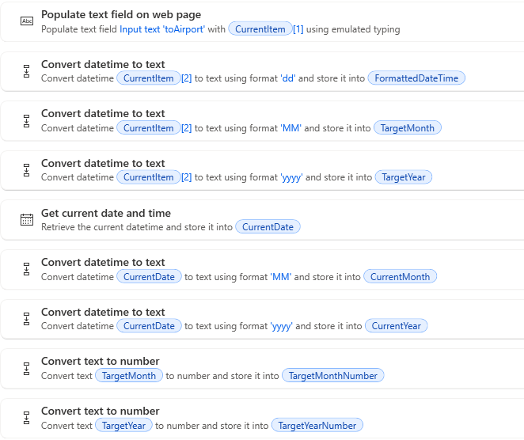
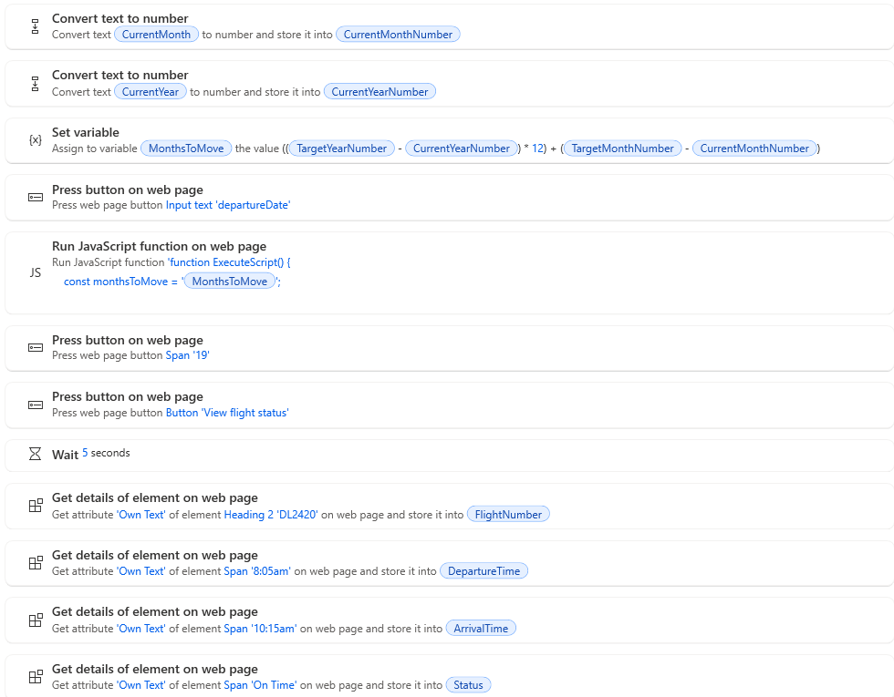
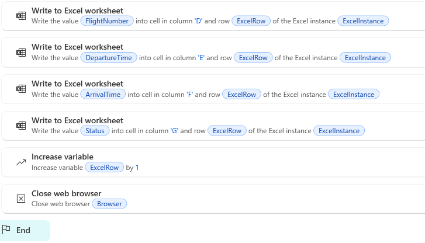

# Delta Flight Status Automation

A Power Automate Desktop project that automates flight-status lookups and writes the results to Microsoft Excel.

## Project Overview

This project uses Microsoft Power Automate Desktop (PAD) to read flight search information from an Excel spreadsheet, interact with a public flight-status webpage, retrieve flight information, and write the results back to Excel.

The automation processes multiple airport routes and dynamically handles the flight date provided in the spreadsheet.

## Technologies Used

- Microsoft Power Automate Desktop
- Microsoft Excel
- JavaScript
- Regular Expressions (Regex)
- Web UI Automation

## Information Retrieved

For each route, the automation retrieves:

- Flight number
- Departure time
- Arrival time
- Flight status

## How It Works

1. Power Automate Desktop reads the origin airport, destination airport, and flight date from Excel.
2. A loop processes each route in the spreadsheet.
3. PAD opens the flight-status webpage and enters the origin and destination airport codes.
4. PAD calculates the number of months between the current date and the requested flight date.
5. JavaScript locates the calendar's **Next Month** control using its ARIA label and clicks it the required number of times.
6. PAD dynamically selects the requested day from the calendar.
7. The flight-status search is submitted.
8. PAD extracts the first displayed flight's flight number, departure time, arrival time, and status.
9. The results are written back to the corresponding row in Excel.
10. The process repeats for the remaining routes.

## Dynamic Date Handling

The flight date is supplied by Excel rather than hard-coded into the automation.

Power Automate Desktop separates the requested date into day, month, and year values and compares the requested month and year with the current date.

The number of months that the calendar needs to move forward is calculated as:

MonthsToMove = ((TargetYear - CurrentYear) * 12) + (TargetMonth - CurrentMonth)

For example, if the current month is September 2026 and the requested flight date is December 10, 2026:

MonthsToMove = ((2026 - 2026) * 12) + (12 - 9)

MonthsToMove = 3

JavaScript then uses this value to navigate the web calendar to the requested month.

## JavaScript Calendar Navigation

The automation uses JavaScript to locate the calendar's **Next Month** control by its ARIA label rather than relying on a dynamically generated element ID.

```javascript
function ExecuteScript() {
    const monthsToMove = %MonthsToMove%;

    for (let i = 0; i < monthsToMove; i++) {
        const nextButton =
            document.querySelector('[aria-label^="Next Month"]');

        if (!nextButton) {
            return "Next Month button not found";
        }

        nextButton.click();
    }

    return "Moved " + monthsToMove + " months";
}
```
## Flow Screenshots

### 1. Excel Input and Loop Setup

The automation reads the flight routes and dates from Excel and processes each spreadsheet row using a `For each` loop.



### 2. Dynamic Date Processing

Power Automate Desktop extracts the requested day, month, and year and prepares the values used to calculate calendar navigation.



### 3. Calendar Navigation and Flight Data Extraction

The flow calculates `MonthsToMove`, uses JavaScript to navigate the calendar, selects the requested date, submits the search, and extracts the flight information.



### 4. Excel Output and Loop Completion

The retrieved flight number, departure time, arrival time, and status are written back to Excel before the automation advances to the next route.



## Challenges and Solutions

### Dynamic Calendar Selectors

**Challenge:**  
The flight-status calendar generated dynamic element IDs for its month-navigation controls. This made the original Power Automate Desktop UI selector unreliable across runs.

**Solution:**  
JavaScript was used to locate the **Next Month** control by its ARIA label instead of relying on the changing element ID. PAD calculates the required number of months in `MonthsToMove`, and JavaScript clicks the calendar control the appropriate number of times.

### Dynamic Flight Dates

**Challenge:**  
The automation needed to work with different flight dates without manually changing the PAD flow.

**Solution:**  
The date is read directly from Excel. PAD separates the date into day, month, and year values, calculates the required calendar movement, and dynamically selects the requested day.

### Multiple Flight Routes

**Challenge:**  
The automation needed to process multiple origin and destination combinations rather than a single hard-coded route.

**Solution:**  
A `For each` loop processes every row in the Excel input range. After retrieving the flight information, PAD writes the results to the corresponding Excel row and advances `ExcelRow` before processing the next route.
